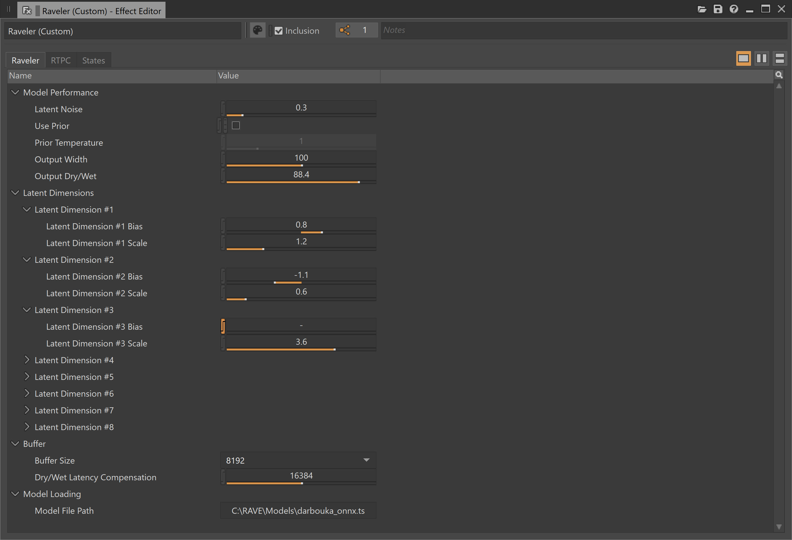

# Raveler

[](https://youtu.be/5RfZWJp6-i4)

Raveler is a [Wwise plugin](https://www.audiokinetic.com/en/library/edge/?source=SDK&id=effectplugin.html) that runs [RAVE](https://github.com/acids-ircam/RAVE) models, enabling real-time timbre transfer via neural audio synthesis in a game audio setting.

Much of the plugin implementation is based on the [RAVE VST](https://github.com/acids-ircam/rave_vst) project.

Demo video: https://youtu.be/5RfZWJp6-i4

## Usage

Simply add a Raveler plugin instance anywhere in your effects chain, specify a model to load, and start playing around!

The plugin consists of 4 main categories of parameters:
1. **Model Performance**
	- **Latent Noise:** Amount of random noise/jitter to add to all latent dimensions
	- **Use Prior:** Whether or not to use the [prior](https://github.com/acids-ircam/RAVE#where-is-the-prior-), if available in the model
	- **Prior Temperature:** The "temperature" to use when sampling the prior (only applies if we're using the prior)
	- **Output Width:** Amount of sampling differences between output channels
	- **Output Dry/Wet:** How much of the input (dry) vs. output (wet) signal to use for final audio output
2. **Latent Dimensions (#1-8)**
	- **Bias:** Which direction (and how much) to bias a given latent dimension in
	- **Scale:** How much to weigh a given latent dimension
3. **Buffer Settings**
	- **Latency Mode:** Size of buffer (in samples) to use for model inference -- higher values result in higher audio quality but more latency
	- **Dry/Wet Latency Compensation:** How long (in samples) to delay the dry signal by to compensate for latency
4. **Model Loading**
	- Model File Path: Path to the RAVE model we wish to use

All the parameters in the **Model Performance** and **Latent Dimensions** categories can be bound to RTPCs.

## Setup

**(TODO: Set this up in CMake or something similar)**

1. Download and add library dependencies:
	1. Download LibTorch 1.11.0 from  https://pytorch.org/ and place the `libtorch` directory in `Libraries/torch` (so that the full path to the library is `Libraries/torch/libtorch`)
		- CPU: https://download.pytorch.org/libtorch/cpu/libtorch-win-shared-with-deps-1.11.0%2Bcpu.zip
		- CUDA 11.3:  https://download.pytorch.org/libtorch/cu113/libtorch-win-shared-with-deps-1.11.0%2Bcu113.zip
	2. Similarly download and add ONNX 1.14.1 to `Libraries/onnx` (so the full path to the library is `Libraries/onnx/onnxruntime`)
		- https://github.com/microsoft/onnxruntime/releases/download/v1.14.1/onnxruntime-win-x64-1.14.1.zip
	4. Download BS::thread_pool 3.5.0 and add the BS_thread_pool.hpp header to `Libraries/bs_thread_pool` (so that the full path to the header is `Libraries/bs_thread_pool/BS_thread_pool.hpp`)
		- https://github.com/bshoshany/thread-pool/releases/tag/v3.5.0

2. Run Wwise premake step. Below is a Windows example (you can substitute 2022.1.5.8242 for your version of Wwise):
```sh
python "C:\Program Files (x86)\Audiokinetic\Wwise 2022.1.5.8242\Scripts\Build\Plugins\wp.py" premake Authoring
python "C:\Program Files (x86)\Audiokinetic\Wwise 2022.1.5.8242\Scripts\Build\Plugins\wp.py" premake Windows_vc160
```
3. Apply settings to the generated solutions (following the above example, the solutions would be RaveWwise_Authoring_Windows_vc160.sln and RaveWwise_Windows_vc160.sln): **(TODO: Add these to PremakePlugin.lua)**
	1. Apply general settings to the entire solution:
		1. Retarget solution > Retarget both RaveWwise and RaveWwiseFX projects to latest Windows SDK version (e.g. 10.0)
	2. Apply project-specific settings to the RaveWwiseFX project:
		1. Properties > General > C++ Language Standard: `/std:c++17` (C++ 17 standard)
			- This is required for BS::thread_pool
		1. (optional, for debugging) Properties > C/C++ > Optimization > `Disabled (/Od)`
		1. C/C++ > All Options > Additional Options: `/utf-8 /GR %(AdditionalOptions)`
			- `/GR` enables run-time type information (used for `std::dynamic_pointer_cast()` in `torch/nn/cloneable.h`)

4. Build for desired platforms, either using Visual Studio or wp.py directly. Below is an example for authoring and Windows (you can substitute 2022.1.5.8242 for your version of Wwise):
```sh
python "C:\Program Files (x86)\Audiokinetic\Wwise 2022.1.5.8242\Scripts\Build\Plugins\wp.py" build Authoring -c Release -x x64 -t vc160
python "C:\Program Files (x86)\Audiokinetic\Wwise 2022.1.5.8242\Scripts\Build\Plugins\wp.py" build Windows_vc160 -c Release -x x64
```

5. Copy library files for authoring, substituting 2022.1.5.8242 with your version of Wwise:
```sh
python "C:\Program Files (x86)\Audiokinetic\Wwise 2022.1.5.8242\Scripts\Build\Plugins\wp.py" package Authoring --version=2022.1.5.8242 --additional-artifacts-file=additional_artifacts.json -copy-artifacts
```

6. Package for desired target platforms. Below is a Windows example (you can substitute 2022.1.5.8242 for your version of Wwise):
```sh
# Package
python "C:\Program Files (x86)\Audiokinetic\Wwise 2022.1.5.8242\Scripts\Build\Plugins\wp.py" package Common --version=2022.1.5.8242
python "C:\Program Files (x86)\Audiokinetic\Wwise 2022.1.5.8242\Scripts\Build\Plugins\wp.py" package Authoring --version=2022.1.5.8242 --additional-artifacts-file=additional_artifacts.json
python "C:\Program Files (x86)\Audiokinetic\Wwise 2022.1.5.8242\Scripts\Build\Plugins\wp.py" package Windows_vc160 --version=2022.1.5.8242 --additional-artifacts-file=additional_artifacts.json

# Bundle
python "C:\Program Files (x86)\Audiokinetic\Wwise 2022.1.5.8242\Scripts\Build\Plugins\wp.py" generate-bundle --version=2022.1.5.8242
```

7. Install from the Audiokinetic Launcher: https://www.audiokinetic.com/library/wwise_launcher/?source=InstallGuide&id=plugins

## Licensing

This work is licensed under [CC BY-NC 4.0](LICENSE), except for Wwise plugin scaffolding portions, which are licensed under [Apache 2.0](http://www.apache.org/licenses/LICENSE-2.0).
